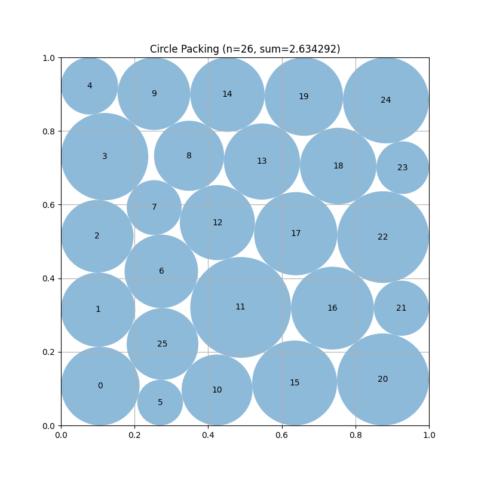
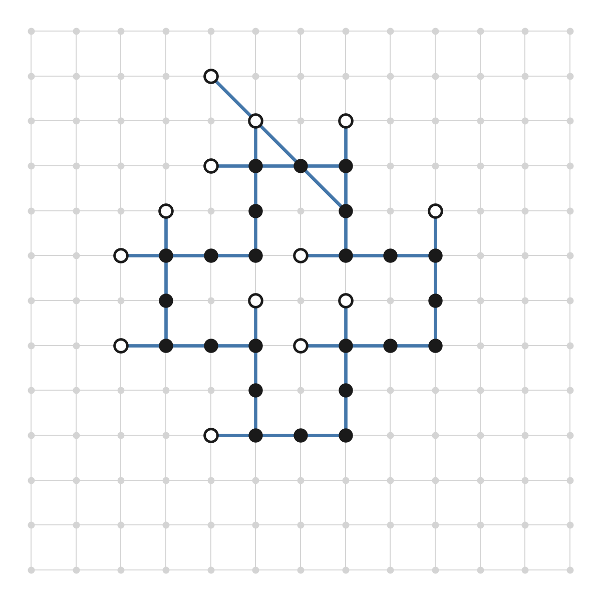
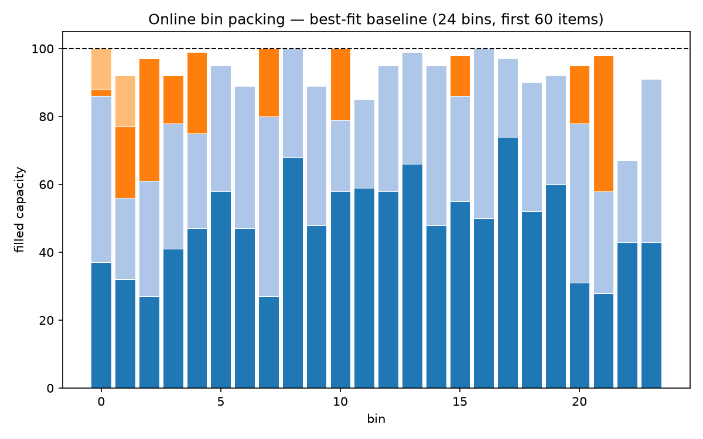

<div align="center">
  <h1>noema</h1>
  <p>Controlled ablation of coordination mechanisms in LLM-driven evolutionary search.</p>
  <p>
    <a href="#install">Install</a> ·
    <a href="#minimal-run-example">Run</a> ·
    <a href="#ablation-axes">Ablation axes</a> ·
    <a href="#example-problems">Examples</a> ·
    <a href="#outputs-and-resume">Outputs</a> ·
    <a href="#guarantees-enforced-by-tests">Guarantees</a> ·
    <a href="#repository-layout">Layout</a>
  </p>
</div>

noema implements an independent evolutionary controller while reusing selected
OpenEvolve components (evaluator, program database, prompt sampler) through
isolated adapters. The study compares coordination **arms** by changing only
`coordination.module`. The shared prompt skeleton, seeds, budget, and loop
behavior stay fixed; module-specific coordination content is the treatment.

## OpenEvolve library context

noema uses OpenEvolve as an installed **library dependency**, not as vendored code
or a local submodule in this repository.

- Borrowed from OpenEvolve: evaluator, program database, prompt sampler, and related
  utility modules accessed through `noema/` adapters.
- Not borrowed: OpenEvolve's top-level iteration orchestration. noema runs its
  own shared iteration runner in `noema/evolution/iteration_runner.py`, hosted
  by `noema/controller.py` and the optional agent host.
- Dependency pin: `openevolve @ git+https://github.com/codelion/openevolve@80945ed`
  (defined in `pyproject.toml`).

This separation keeps the study variable controlled: coordination changes are
isolated to noema modules while the substrate remains pinned within each
mechanism comparison.

## What this repository provides

- A standalone controller in `noema/controller.py`
- An optional agent host in `noema/agenthost/` that runs the same iteration
  semantics through nested coding CLIs
- Pluggable coordination modules behind `noema/coordination/base.py`
- Shared token metering for in-process LLM calls via `noema/budget/`
- Checkpoint/resume support including controller, DB, ledger, and coordination state
- Tests that protect prompt identity, metering integrity, and determinism

The [`noema` package guide](noema/README.md) lists the public API and subpackages.
Study specifications and planning documents are maintained in the canonical
Noema vault instead of being duplicated across repository branches.

## Install

Python 3.10+ is required.

```bash
pip install -e ".[dev]"
```

This installs `noema` plus the pinned OpenEvolve library dependency from commit `80945ed`.

## Minimal run example

```python
import asyncio
from noema import NoemaConfig, NoemaController

config = NoemaConfig.from_yaml("experiment.yaml")
controller = NoemaController(
    config=config,
    evaluation_file="evaluator.py",  # defines evaluate(program_path)
    initial_program_code=open("initial.py").read(),
    output_dir="runs/arm_off",
)
best = asyncio.run(controller.run())
```

### Arm selection (single controlled variable)

```yaml
budget:
  total_tokens: 1000000
coordination:
  module: "null"            # OFF / brute-force baseline
  # module: "hifo"
  # module: "pes-faithful"
  # module: "bandit"
  # module: "pe"
substrate:
  kind: "islands"           # or "tree" / "cvt"
selection:
  policy: "substrate_default"   # or "stock_openevolve" / "boltzmann" / "uct" / "cvt_ucb"
```

Use identical config outside `coordination.module` when comparing arms.

## Ablation axes

The study varies coordination **mechanisms** against population **substrates** at
equal token budget. Selection policy is a separate configurable component used
for native substrate policies and gated probes. Compatible policies and stores
compose through one capability-checked interface.

### Mechanisms — `coordination.module`

| mechanism | status | what it is |
|---|---|---|
| `null` | **implemented** | coordination-OFF. The control arm. |
| `hifo` | **implemented** | Source-faithful HiFo-Prompt re-port with documented repairs and deviations. |
| `pes-custom` | **implemented** | The noema plan–execute–summarize variant with concise prompts and advisory execution. |
| `pes-faithful` | **implemented** | LoongFlow plan–execute–summarize, near-verbatim recast. The reference / validity anchor. Its registry key fixes the prompt and executor variants. |
| `bandit` | **implemented** | AsymmetricUCB over the operator menu. It makes no coordination LLM calls. |
| `pe` | **implemented** | Punctuated equilibrium with periodic paradigm-shift and variant proposals. |

### Substrates — `substrate.kind`

| substrate | status | what it is |
|---|---|---|
| `islands` | **implemented** | islands + MAP-Elites. Migration-mixed fronts, broken lineages. |
| `tree` | **implemented** | global tree + UCT. Deep persistent lineages. |
| `cvt` | **implemented** | CVT archive with deterministic behavior regions. |

### Selection policies — `selection.policy`

| policy | status | what it is |
|---|---|---|
| `substrate_default` | **implemented** | the store's native policy. |
| `stock_openevolve` | **implemented** | OpenEvolve's sampling, unchanged. |
| `boltzmann` | **implemented** | Boltzmann sampling with adaptive temperature and optional stagnation detection. |
| `uct` | **implemented** | UCT selection for the tree substrate with token-budget exploration decay. |
| `cvt_ucb` | **implemented** | UCB selection across CVT regions. |

## Example problems

Benchmark inputs used to compare coordination arms live under `examples/`.

<table>
  <tr>
    <td align="center" width="220">
      <a href="examples/circle_packing"></a><br />
      <a href="examples/circle_packing"><b>Circle Packing</b></a><br />
      <sub>Pack 26 circles in a unit square to maximize the sum of radii.</sub>
    </td>
    <td width="24"></td>
    <td align="center" width="220">
      <a href="examples/morpion_solitaire"></a><br />
      <a href="examples/morpion_solitaire"><b>Morpion Solitaire</b></a><br />
      <sub>Grow the longest legal line-drawing sequence on a cross-shaped grid.</sub>
    </td>
    <td width="24"></td>
    <td align="center" width="220">
      <a href="examples/bin_packing"></a><br />
      <a href="examples/bin_packing"><b>Bin Packing</b></a><br />
      <sub>Pack weighted items into a minimal number of fixed-capacity bins.</sub>
    </td>
  </tr>
</table>

## Outputs and resume

- Checkpoints: `output_dir/checkpoints/`
- LLM call log: `output_dir/llm_calls.jsonl`
- Attempt trace: `output_dir/attempt_trace.jsonl` (one append-only record per
  mutation attempt, including rejected attempts, complete rendered prompts and
  responses, coordination advice, evaluator diagnostics, and linked call IDs)
- Selection trace: `output_dir/selection_trace.jsonl` (the accepted program and
  exact attempt selected after retry resolution and successful database insertion)
- Evolution trace: `output_dir/evolution_trace.jsonl` (includes per-mutation
  prompt/response/metrics metadata plus iteration token-ledger breakdown;
  retained for compatibility)

Resume by loading a checkpoint before running:

```python
controller.load_checkpoint("runs/arm_off/checkpoints/<checkpoint_name>")
best = asyncio.run(controller.run())
```

## EvoReplay export

Analysis lives in the separate private
[noema-analysis](https://github.com/archie-brown3/noema-analysis) repository, so
EvoReplay is not a dependency of experiment runs. Export a completed run to
EvoReplay's refined layout with:

```bash
python -m noema.export_evoreplay runs/<run-id> \
  --output ../noema-analysis/data/refined/<run-id>
```

The export writes content-addressed program and prompt blobs, checkpoint
membership, iteration scalars, token/cost summaries, and lossless copies of the
Noema attempt and selection traces.

## Guarantees enforced by tests

- **Prompt identity across arms**: shared prompt prefix stays byte-identical
- **No unmetered in-process LLM calls**: mutation and coordination usage flows through the ledger
- **Determinism controls**: deterministic IDs and isolated coordination RNG stream

For cross-process bit-identical reruns, pin `PYTHONHASHSEED`.

## Borrowed and adapted code

- `noema/coordination/hifo/` contains code copied from
  [HiFo-Prompt](https://github.com/Challenger-XJTU/HiFo-Prompt)
- `noema/coordination/pes/` contains code adapted from
  [LoongFlow](https://github.com/baidu-baige/LoongFlow) (Apache-2.0)
- `noema/coordination/bandit/` ports the AsymmetricUCB kernel from
  [ShinkaEvolve](https://github.com/SakanaAI/ShinkaEvolve) (Apache-2.0)
- `noema/coordination/pe/` and `noema/substrates/cvt_behavior.py` adapt components from
  [LEVI](https://github.com/ttanv/levi) (MIT)
- `noema/substrates/tree.py` and `noema/selection/uct.py` adapt the tree and UCT kernels
  from MCTS-AHD commit `ee9c4f424503c65a5fd2b899e6620ce86079fedb`
  (MIT)

Borrowed files include provenance headers; local changes are marked with `NOEMA:`.

## Repository layout

```text
noema/
  budget/        token accounting and metered LLM access
  agenthost/     optional nested-CLI mutation host
  coordination/  experiment arms and their shared interface
  evolution/     mutation, prompts, boundaries, diffs, and evaluation
  selection/     store-neutral parent-selection policies
  substrates/    population stores and runtime composition
tests/           regression tests for noema guarantees and modules
examples/        benchmark inputs (run artifacts are gitignored, not committed)
```

## Run tests

```bash
pytest tests/test_noema_*.py
# or
python -m unittest discover tests
```
